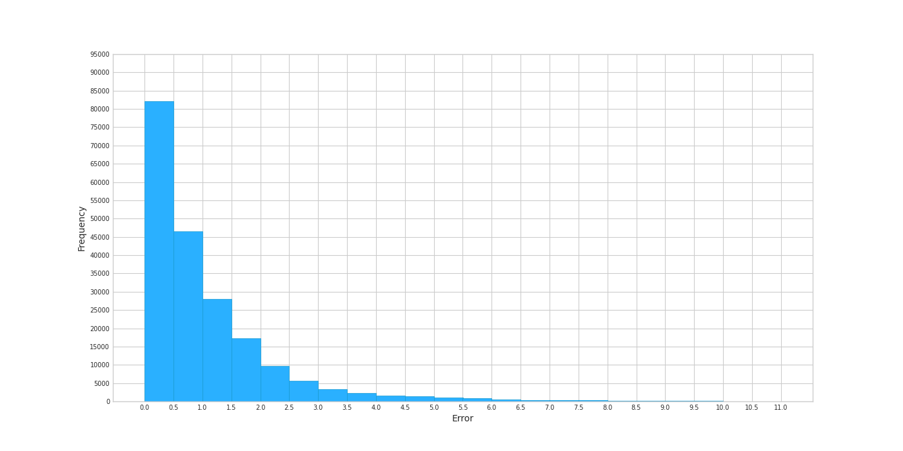

## Intro

This repo presents objective embeddings, extracted used unsupervised learning, for **12,239 students** and **1303 disciplines** derived from **472,170 gradebook records** of students from the *Faculty of Automatic Control and Computer Science* (ACS), from *University Politehnica of Bucharest* (UPB). Performances were validated on another **202,359 records** from the same source.

This was an experiment I managed to run back ~2018 on completely anonymized dataset. The shared model can illustrate only typologies of students and disciplines but it is impossible to recover sensitive information such as names. Moreover, the complete dataset will not be shared.

**Note:** in this PoC, the 1-10 grading system is used, with 10 being the highest possible grade and 1 the lowest.

## Objectives

The objective of this experiment was to demonstrate that both students and disciplines can be accurately clustered together with little to no information in an unsupervised manner. This permits further analysis such as:

* identifying if disciplines from a field of study are closely related and relevant - e.g., Algorithms and Biology are fairly different disciplines, most probably belonging in different clusters; but Algorithms and Data Structures should probably be studied together. 
* identifying levels of compatibility between students - e.g., if 2 students can work together, on the same level, at a project which requires knowledge from a specific field.
* determining compatible disciplies for different students - e.g., students who intensively studied CS-related disciplines might not be great at Chemistry and therefore some adjustments are required.
* detecting possible fraud - e.g., a student with low grades is fairly unlikely to get a 10/10 at a difficult exam. 

All of this information can be derived without relying on rather subjective knowledge on how good a student really is or what information is being taught at a specific discipline. 

## Methodology

> Students who are good at math are more likely to get good grades at math-related disciplines.

Based on this idea, one can estimate posterior probabilities by relying on known priors and some sort of evidence or likelihood. If both the prior and the posterior probabilities are known, it is trivial to run optimization steps in order to adjust the evidence or likelihood.

*For example...*
If student A has 10/10 at both Calculus 1 and Linear Algebra, there's a good chance student A will get a 10/10 at... let's say Statistics. Now, if student A happens to get another 10/10 grade at an unknown discipline, one can presume that the unknown discipline might as well be math-related, therefore gaining valuable insight. This also works for other scenarios involving lower grades or other parallel knowledge.

## Results

The last checkpoint is attached: **2.688863608570854.dat** and the Python3 script used to generate the content.

### Quantitative

I tracked the distribution of grade prediction errors, as shown below. In **~40%** of cases, the error for the predicted grades is in the **[-0.5, 0.5]** interval which seems promising.

### Qualitative

I've extracted some of the embeddings for disciplines which I've been attending during my bachelor degree and which I could verify based on my experience. Unfortunately, the names are in Romanian so this mostly makes sense to people who know these disciplines themselves.

The embeddings are reduced initially via *PCA* and then *T-SNE* to a 2D system of coordinates and then plotted on a graphic.

The following clusters are easily visible and verifiable (naming by me):
1. **Electronics**: EEA (Analog Electronics), ED (Digital Electronics), PM (Design with Microprocessors)
2. **Math**: M1 (Calculus), M2 (Linear Algebra), TS (Systems Theory), F (Physics), BE (Basics of Electrotechnics), MN (Numerical Methods)
3. **Foreign Languages**: LS1, LS2, LS3, LS4 (Foreign Languages 1-4), EFS1, EFS2 (Physical Education and Sport) + some other which are considered probably easy disciplines for students 
4. **Low-level Software**: ASC (Architectures of Computing Systems), Co (Compilers), SO (Operating Systems), SOI (Operating Systems 2)
5. **Algorithmics**: PA (Designing Algorithms), PP (Programming Paradigms), PCom (Communication Protocols)
6. **Coding**: PC (Computers Programming), SD (Data Structures), POO (Object-oriented Programming), USO (Usage of Operating Systems), IOCLA (Introduction to Computer Structure and Assembly Language) 
7. **Game Programming**: EGC (Elements of Computer Graphics), SPG (Systems of Graphical Processing); interestingly enough, APD (Parallel and Distributed Algorithms) is placed close to these but it's not "directly" related to them - could be the fact that all of them rely on working with larger C/C++ codebases?

